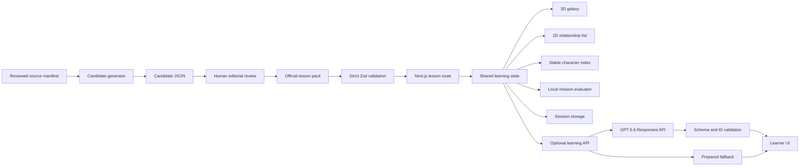

# AI Character Galaxy Architecture

## Design goals

AI Character Galaxy is a local-first educational web application. The reviewed lesson pack is always the source of truth; GPT-5.6 is a constrained enhancement that may explain or reorganize reviewed facts but cannot create official facts. A learner can complete every required outcome without an API key, network access, WebGL, registration, or personal data.

## System map

## Runtime boundaries

### Reviewed content layer

- `content/lesson-packs/*.json` contains official lesson data.
- `lib/lessons/schema.ts` defines the strict schema and cross-reference rules.
- `lib/lessons/repository.ts` parses packs at module load and exposes read-only lookup.
- Every character and relationship references a source. Literary relationships require a locator. Low-confidence relationships cannot power official missions.

### Deterministic learning engine

- `lib/layout/galaxy-layout.ts` produces a repeatable layout from the pack seed.
- `lib/layout/relationship-space.ts` derives a deterministic target-centered coordinate system from reviewed relationship types, strengths, directions, and learning tags.
- `lib/layout/relationship-transition.ts` owns the mutable display vectors used by every 3D consumer; one frame controller damps those vectors toward the latest semantic targets.
- `lib/missions/evaluate.ts` checks mission evidence locally; no model grades the learner.
- `lib/session/learning-session.ts` validates, deduplicates, saves, and restores same-tab progress.
- `components/learning/LearningExperience.tsx` owns the shared selection state used by both visualizations.

The 2D list is not a simplified emergency page. It exposes the same people, relationship types, direction, disputed labels, evidence selection, mission actions, and learning outcomes as the canvas. The always-available character index owns selection independently of projected WebGL labels, so camera depth and decorative layers cannot block a person.

#### Target-centered relationship space

Selecting a character reorganizes the galaxy around a stable origin rather than moving the camera to a planet. The semantic coordinates are fixed and explainable:

- Radius represents relational proximity. Direct, stronger ties sit nearest the selected person; second-degree and contextual people occupy progressively wider shells.
- Vertical position represents relationship valence. Affinity, loyalty, mentorship, and romance rise; conflict, rivalry, betrayal, and violence fall.
- Depth represents context. Personal, family, and private ties sit toward the viewer; public, political, and institutional ties recede.
- Lateral position represents relationship direction. Incoming and outgoing influence use opposing sides, with deterministic seeded lanes preventing collisions.

Breadth-first graph distance defines direct, second-degree, and contextual layers. Reviewed `relationship.type`, `strength`, `direction`, and `learningTags` provide the semantic scores; no runtime model call participates in layout. The selected character is exactly `[0, 0, 0]`, all other coordinates are stable for the same pack and target, and collision separation is deterministic.

`RelationshipSpaceController` updates the shared `THREE.Vector3` store once per frame. Planets copy those vectors, relationship geometry rewrites its endpoints, pulses interpolate along them, and HTML labels project them. This single position authority prevents lines and labels from lagging behind the planets. Reduced-motion mode snaps directly to target coordinates. Orbit controls remain centered on the origin, eliminating selection-driven camera jumps.

On desktop, the observatory owns one viewport and the mission, galaxy, character index, and evidence panels manage their own bounded content. Tablet and phone layouts return to normal document flow. The canvas has no independent vertical scroll range, while the character index retains deliberate horizontal scrolling.

### Exhibition and motion layer

- `components/navigation/ExhibitionHeader.tsx` provides one navigation language across the landing page, course register, character atlas, and lessons.
- `components/motion/SmoothScroll.tsx` is the single Lenis owner and connects one request-animation-frame source to GSAP and ScrollTrigger.
- Reduced-motion and coarse-pointer environments retain native scrolling and remove nonessential entrance transforms.
- The galaxy uses deterministic particles, bounded device-pixel ratios, procedural shader materials, and invisible hit spheres with explicit interaction metadata. Projected labels and particle fields never receive pointer input.
- The generated observatory artwork is a static visual layer; WebGL planets remain procedural, responsive, and selectable.

### GPT-5.6 enhancement layer

The three lesson server-only endpoints are:

- `POST /api/learning/explain`
- `POST /api/learning/assessment`
- `POST /api/learning/summary`

Processing sequence:

1. Parse a strict request schema and cap all arrays/string fields.
2. Resolve the official lesson on the server.
3. Reject any input ID outside that pack.
4. Build a prompt containing reviewed summaries and allowed IDs only.
5. Call `openai.responses.parse` with `gpt-5.6`, low reasoning effort, Zod Structured Outputs, timeout, and anonymous `safety_identifier`.
6. Parse again and verify returned entity, relationship, and source IDs against the pack.
7. Return `{ source: "gpt-5.6", data }` or the same validated data shape with `source: "prepared"`.

At most two model attempts are made. A missing key, network exception, timeout, refusal, malformed result, or unknown reference selects the prepared fallback. No raw model string is written into React state.

### Custom character research boundary

`POST /api/characters/query` is intentionally separate from reviewed lessons. It accepts a bounded character name, calls GPT-5.6 through the Responses API with required web search, validates the resulting profile with Zod, and returns visible citations. Requests use a hashed anonymous safety identifier, a twenty-second timeout, and one bounded retry. Invalid input returns `400`, a refusal or unresolved person returns `422`, upstream failure returns `502`, and missing server configuration returns `503`. Generated profiles are labeled as AI research, stay in transient UI state, and cannot become lesson evidence or alter reviewed directory entries.

## Privacy and under-18 boundary

The product requests no account, learner name, email, school, demographic profile, or location. The runtime sends no learner-written mission response to OpenAI. The model receives lesson IDs and reviewed lesson context; the safety identifier is a SHA-256-derived value based on a local session marker, not a user identity. Progress is stored only in `sessionStorage` and disappears when the tab session ends.

## Content generation boundary

`scripts/generate-lesson-pack.ts` is deliberately separated from runtime learning:

1. Parse a reviewed source manifest.
2. Send only its normalized excerpts and provenance to GPT-5.6.
3. Require a structured `LessonPack` candidate.
4. Verify candidate source metadata against the manifest.
5. Write only to a new `.candidate.json` path outside `content/lesson-packs`.
6. Require automated validation and human editorial review before promotion.

The generator cannot overwrite existing candidates or official packs.

## Failure modes

| Failure | Controlled behavior |
| --- | --- |
| No OpenAI key/network | Prepared explanations, questions, hints, and summaries; core flow unchanged. |
| No key for custom research | Reviewed character atlas remains available; the research form reports that server configuration is required. |
| Invalid model reference | Bounded retry, then prepared fallback. |
| WebGL unavailable | Announced 2D list with shared lesson state. |
| Corrupt stored session | Fresh validated local session. |
| Invalid official pack | Build/module load fails before learners see partial content. |
| Missing evidence/locator | Content validation fails; review report marks a blocker. |
| Low-confidence or disputed edge | Label in UI/report; low-confidence edge excluded from official missions. |

## Verification layers

- Content: schema, referential integrity, evidence, locators, objective coverage, provenance manifests, review reports.
- Unit: deterministic layout and visual budgets, mission rules, session validation, OpenAI output and ID rejection.
- Component: Apple-inspired discovery surfaces, introduction, source cards, 2D/3D state, offline path, AI fallback card.
- API integration: strict input, no-key fallback, privacy-safe safety identifier.
- Browser: exhibition navigation, character deep links and research, both complete lessons, stable planet selection, keyboard, reduced-motion, phone viewport, and forced WebGL failure.
- Production: ESLint, TypeScript, and optimized Next.js build.

## Extension points

New official lessons need a source manifest, a validated pack, an automated report with zero blockers, and human editorial approval. Localization can add reviewed locale-specific packs without changing mission evaluation. Future teacher tools should remain outside the anonymous learner runtime and must not introduce hidden ability labels or automated high-stakes judgments.
